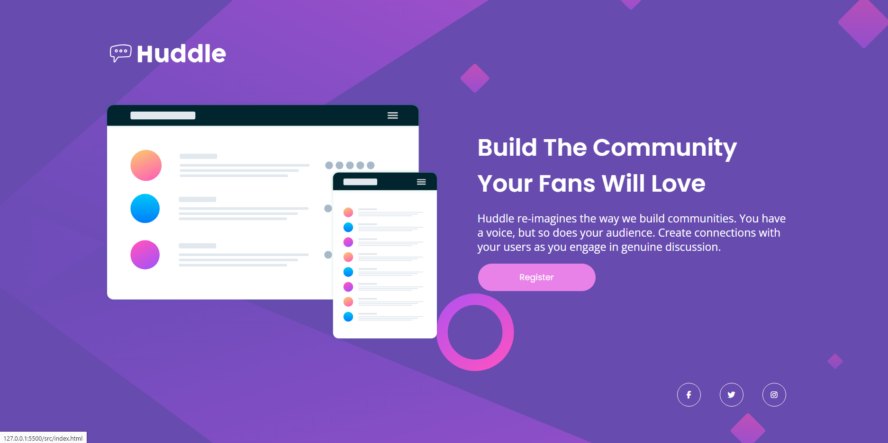

# Quest Dev em Dobro

## Projeto proposto pelo curso dev em dobro, colocando em prática flex, grid layout e diversos aprendizados durante as aulas.

▪ Ferramentas Utilizadas <br>
▫ HTML <br>
▫ CSS <br>

<br>

## 1 - Clone para o projeto: 
```
https://github.com/Daniel-W-Carvalho/Quest-dev-em-dobro.git
```


